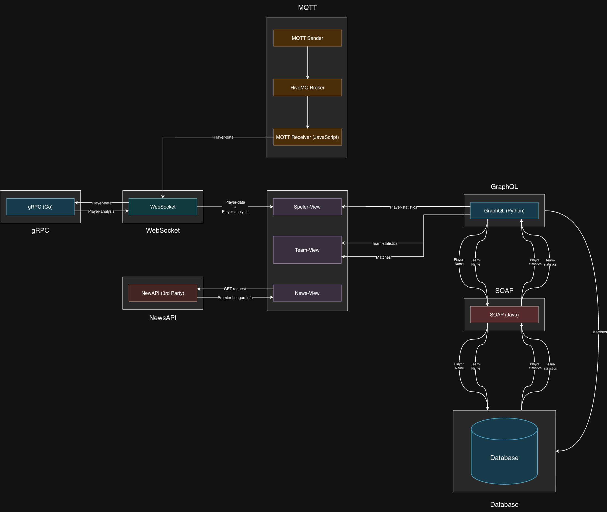

# Project Cloud Computing: Football manager

Dit project simuleert een voetbalmanager. Je kunt zoeken naar teams, de prestaties van spelers bekijken (gesimuleerd) en het laatste nieuws van de Premier League lezen.
Voor meer specifieke documentatie, zie de README's in de betreffende mappen.

## Services
- SOAP (Java): haalt gegevens op uit de database voor GraphQL
- GraphQL (Python): query voor de teams, matches en spelers
- MQTT (JavaScript): de prestaties van een speler simuleren
- gRPC (Go): deze prestatie analyseren
- WebSockets (JavaScript, behoort tot MQTT-file): zorgt ervoor dat de gegevens naar de browser verzonden worden

## De verschillende views:
### Team view
In deze weergave kan er gezocht worden naar een Premier League-team. Hiermee worden de statistieken van dit team voor het seizoen 2018-2019 weergegeven.De teamstatistieken worden opgehaald uit de GraphQL-services die SOAP gebruikt om de gegevens uit de database te halen. De matches worden wel direct uit de database gehaald om overhead te vermijden. Als je de spelerswidget 'uitvouwt', kun je alle spelers van dit team zien. Hier kun je naar de spelersweergave navigeren.

### Player view
In deze weergave worden de spelersstatistieken getoond die ook uit de database worden opgehaald met behulp van de GraphQL-SOAP pipeline. De spelers-data wordt gebruikt om de prestaties van spelers tijdens een wedstrijd te simuleren. Dit wordt gedaan door MQTT. De spelersanalyses zijn gebaseerd op deze gegevens uit de MQTT. Deze gegevens worden geanalyseerd door gRPC. De grafieken zijn gemaakt met behulp van de bibliotheek van Chart.js. De gegevens van MQTT en gRPC worden gepubliceerd op een WebSocket, zodat de gegevensstroom gemakkelijk toegankelijk is voor de browser.

### News view
Deze weergave toont het laatste sportnieuws uit de Premier League (indien beschikbaar). Hiervoor wordt gebruikgemaakt van een third-party API, genaamd NewsAPI.

## Endpoints
- Laravel (Web): `http://localhost:8000`
- SOAP: `http://localhost:8001/ws`
- GraphQL: `http://localhost:5001`
- MQTT: HiveMQ
- gRPC: `localhost:50051`
- WebSockets: `ws://localhost:9292`
- Chart: `http://localhost:3000`

## Architecture
